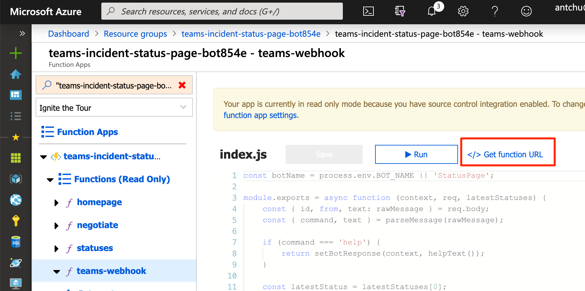
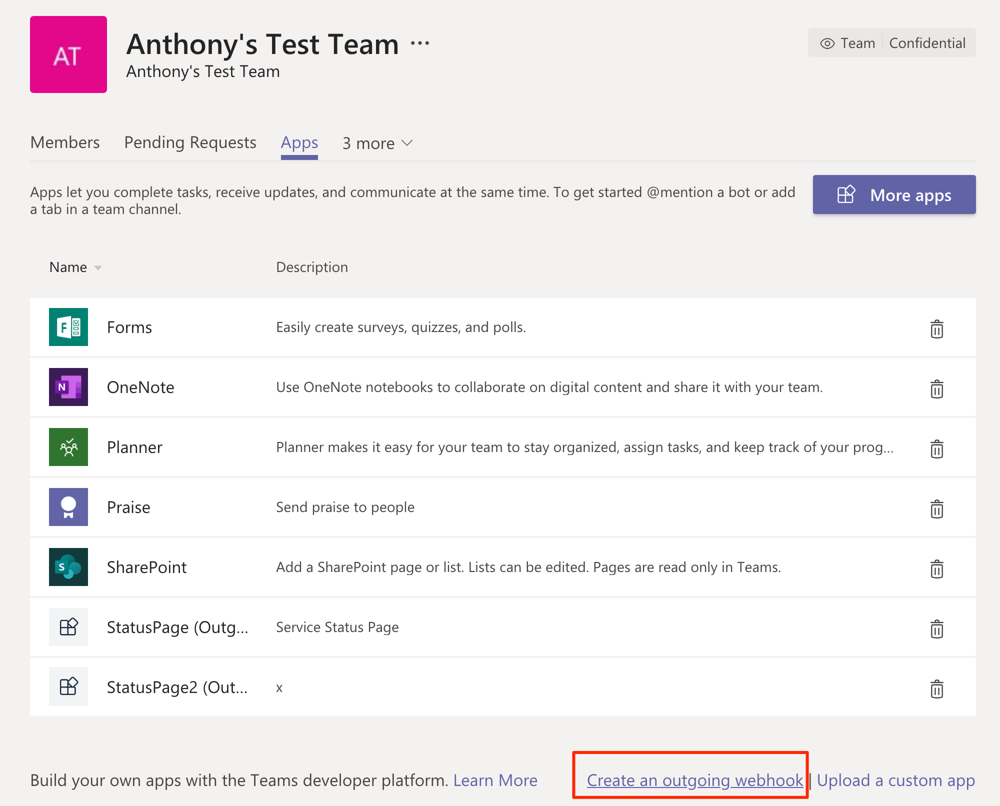

# Official Microsoft Sample

<!-- 
Guidelines on README format: https://review.docs.microsoft.com/help/onboard/admin/samples/concepts/readme-template?branch=master

Guidance on onboarding samples to docs.microsoft.com/samples: https://review.docs.microsoft.com/help/onboard/admin/samples/process/onboarding?branch=master

Taxonomies for products and languages: https://review.docs.microsoft.com/new-hope/information-architecture/metadata/taxonomies?branch=master
-->

Give a short description for your sample here. What does it do and why is it important?

## Contents

Outline the file contents of the repository. It helps users navigate the codebase, build configuration and any related assets.

| File/folder       | Description                                |
|-------------------|--------------------------------------------|
| `src`             | Sample source code.                        |
| `.gitignore`      | Define what to ignore at commit time.      |
| `CHANGELOG.md`    | List of changes to the sample.             |
| `CONTRIBUTING.md` | Guidelines for contributing to the sample. |
| `README.md`       | This README file.                          |
| `LICENSE`         | The license for the sample.                |

## Prerequisites

Outline the required components and tools that a user might need to have on their machine in order to run the sample. This can be anything from frameworks, SDKs, OS versions or IDE releases.

## Setup

Explain how to prepare the sample once the user clones or downloads the repository. The section should outline every step necessary to install dependencies and set up any settings (for example, API keys and output folders).

## Runnning the sample

Outline step-by-step instructions to execute the sample and see its output. Include steps for executing the sample from the IDE, starting specific services in the Azure portal or anything related to the overall launch of the code.

## Key concepts

Provide users with more context on the tools and services used in the sample. Explain some of the code that is being used and how services interact with each other.

## Contributing

This project welcomes contributions and suggestions.  Most contributions require you to agree to a
Contributor License Agreement (CLA) declaring that you have the right to, and actually do, grant us
the rights to use your contribution. For details, visit https://cla.opensource.microsoft.com.

When you submit a pull request, a CLA bot will automatically determine whether you need to provide
a CLA and decorate the PR appropriately (e.g., status check, comment). Simply follow the instructions
provided by the bot. You will only need to do this once across all repos using our CLA.

This project has adopted the [Microsoft Open Source Code of Conduct](https://opensource.microsoft.com/codeofconduct/).
For more information see the [Code of Conduct FAQ](https://opensource.microsoft.com/codeofconduct/faq/) or
contact [opencode@microsoft.com](mailto:opencode@microsoft.com) with any additional questions or comments.

# Teams incident status bot

# Teams incident status bot

## Deployment instructions:

- Create the Azure Function app, Storage account, and SignalR Service with this button: 

- Incident statuses are stored in a table in the Storage account, but there's no way to create this table with ARM. In the Azure portal, open the Storage account and add a table named `statuses`.

- Now navigate to the function app, and open the `teams-webhook` function. Click "Get Function URL" and copy the URL.

    

- Finally, open Teams and navigate to the "Apps" page of the team in which you want to create the bot. Click "Create outgoing webhook".

    

    Use `StatusPage` as the bot name (this is hardcoded, for now). Paste in the function URL, and enter a description.

    

    You will be prompted with a secret code for validating webhook calls from Teams. We currently do not use this. Close the dialog box.
    
